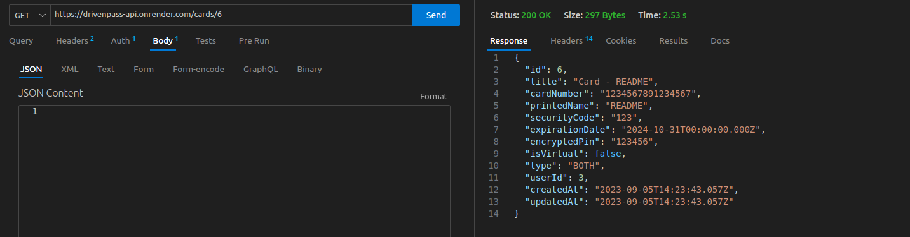

# DrivenPass
_An easy and safe way to save your private information. Safely store your credentials, notes, and cards, so you never forget your information and can access it quickly and clearly whenever you need. All this, just with a master password_. 





Try it out now in back-end at https://drivenpass-api.onrender.com

## About this Project
DrivenPass is a robust REST API designed to serve as your ultimate password manager. With DrivenPass, you gain the ability to securely create and access all the information you need through a single master password. 

This powerful tool allows you to manage credentials for specific websites, create freeform notes, and store card information with ease. The standout feature? All your data, including passwords, is encrypted, ensuring maximum security and user-centric decryption.

- **Health** (`/health`) 🔓
  - Route to check the application's status.

- **Users** (`/users`) 🔓
  - Account Creation:
    - Users can create accounts by providing a valid email and a secure password.
  - Account Access:
    - Users can log in using their email and password.
    - After successful login, they receive a JWT token for authentication in all future requests.
    
- **Credentials** (`/credentials`) 🔒
  - Credential Creation:
    - Users can store login information for websites and services.
    - Credentials include a URL, a username, and a password.
  - Credential Retrieval:
    - Users can list all their credentials or retrieve a specific one by ID.
  - Credential Deletion:
    - Users can delete a credential by ID.

- **Secure Notes** (`/notes`) 🔒
  - Secure Note Creation:
    - Users can create secure notes with a title and content.
  - Secure Note Retrieval:
    - Users can list all their notes or retrieve a specific one by ID.
  - Secure Note Deletion:
    - Users can delete a note by ID.

- **Cards** (`/cards`) 🔒
  - Card Creation:
    - Users can create secure cards with a title and content.
  - Card Retrieval:
    - Users can list all their cards or retrieve a specific one by ID.
  - Card Deletion:
    - Users can delete a card by ID.

- **Erase** (`/erase`) 🔒
  - Erases all information belonging to the user and then the record itself.

## Technologies
The following badges are the tools and technologies used in the construction of the project: 

- [](https://nestjs.com/)

- [](https://www.typescriptlang.org/)

- [](https://www.postgresql.org/)

- [](https://www.prisma.io/)

- [](https://github.com/visionmedia/supertest)

- [](https://www.npmjs.com/package/bcrypt)

- [](https://www.npmjs.com/package/cryptr)

- [](https://jwt.io/)

- [](https://swagger.io/)

## How to run for development

1. Clone this repository
2. Install all dependencies

```bash
$ npm i
```

3. Create a PostgreSQL database with whatever name you want
4. Configure the `.env` file using the `.env.example` file (see "Running application locally or inside docker section" for details)
5. Run all prisma migrations

```bash
$ npm run prisma:prod
```

6. Run the back-end in a development environment:

```bash
# development
$ npm run start

# watch mode
$ npm run start:dev

# production mode
$ npm run start:prod
```

## How to run tests

1. Follow the steps in the last section
2. Configure the `.env.test` file using the `.env.example` file (see "Running application locally or inside docker" section for details)
3. Run all prisma tests migrations:

```bash
$ npm run test:prisma
```

4. Run test:

```bash
# unit tests
$ npm run test

# e2e tests
$ npm run test:e2e

# test coverage
$ npm run test:cov
```

## Support

Nest is an MIT-licensed open source project. It can grow thanks to the sponsors and support by the amazing backers. If you'd like to join them, please [read more here](https://docs.nestjs.com/support).

## Stay in touch

- Author - [Kamil Myśliwiec](https://kamilmysliwiec.com)
- Website - [https://nestjs.com](https://nestjs.com/)
- Twitter - [@nestframework](https://twitter.com/nestframework)

## License

Nest is [MIT licensed](LICENSE).
